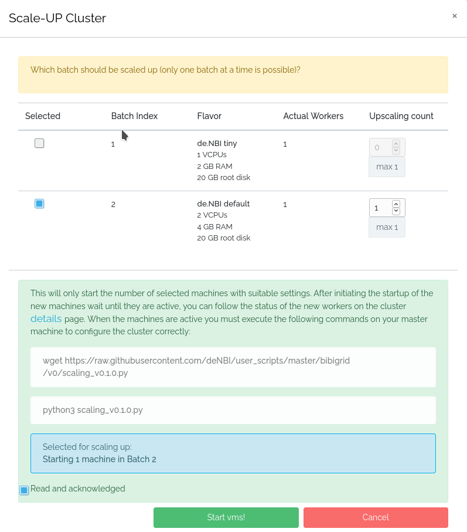

# Cluster overview

On this page we guide you through the cluster overview.

## Layout


### 1. General Cluster information
In the first row you will find the id of your cluster and its current status (clicking on the name will take you to the detail page of the respective cluster), the project it belongs to (clicking on the project name will take you to the project management page of the respective project), the name of the creator and the date it was created at.
### 2. How to connect
Clicking this button will show you commands and information on how to connect to the master instance of your cluster.
### 3. Scale-Up
It is possible to expand a cluster and add more workers by clicking on scale-up.
This will open a modal where you have to specify the number of additional workers.



Therefore it is calculated how many maximum workers are possible. Furthermore it is currently only possible to start workers with the same flavor and image as the previous workers.

**This will only initiate the start of the workers.
The cluster has to be configured correctly, so please wait until all new workers are active in the cluster detail overview until you configure the cluster!**.

####  Configuring Master
For the cluster to use the new workers the master must be reconfigured.
Therefore  you have to do the following steps:

<ol>
<li>Download a script:


```BASH
wget https://raw.githubusercontent.com/deNBI/user_scripts/master/bibigrid/v0/scaling_up_v0.py
```


</li>
<li>For each new worker you have to prepare a yml file with the following structure:

```yaml
ip: 192.168.1.117
cores: 2
hostname: bibigrid-worker-1-1-yif3uig7qvwlbmv
memory: 2048
epheremals: []
```
This example yaml file would be saved as:<br> **192.168.1.117.yml** <br>
<br>
**You can find this information for every worker in the cluster detail overview!<br>
Navigate to the respective worker and on the right side click on "Scaling Info".**


</li>
<li>
Now the downloaded script has to be executed, as parameter the private ip of each new worker has to be passed

```BASH
python3 scaling_up_v0.py 192.168.1.117
```
**_NOTE:_** Sometimes the ansible script can fail with the error message **Could not get lock /var/lib/dpkg/lock-frontend - open (11: Resource temporarily unavailable)** <br>
Then you have to wait a few minutes and run the script again

When the script has run, your cluster is properly configured again and the new workers can be used!
</li>

You can check with the command **sinfo** if the worker has been added correctly!

**If the new worker is still missing you can try to restart slrum with the following command:**
```BASH
sudo /etc/init.d/slurmctld restart
```
**If the worker is still missing after the command has been executed something went wrong and you should contact the support.**
</ol> 


### 4. Scale-Down
If you want to use less resources with your cluster you can also scale down your cluster by clicking the scale-down button.
<br>This will open a modal where you have to specify which workers should be deleted.


Once you have selected which workers to delete and confirmed, these machines are deleted.<br>
**Your cluster must still be configured!**.

Therefore  you have to do the following steps:

<ol>
<li>Download a script:


```BASH
wget https://raw.githubusercontent.com/deNBI/user_scripts/master/bibigrid/v0/scaling_down_v0.py
```


</li>

<li>
Now the downloaded script has to be executed, as parameter the private ip of each deleted worker has to be passed

```BASH
python3 scaling_down_v0.py 192.168.1.54 192.168.1.62
```

When the script has run, your cluster is properly configured again!


</li>
You can check with the command **sinfo** if the worker has been removed correctly!

**If the  worker is still there you can try to restart slurm with the following command:**
```BASH
sudo /etc/init.d/slurmctld restart
```
**If the worker is still there after the command has been executed something went wrong and you should contact the support.**
</ol> 


### 5. Delete Cluster
This will delete the cluster and every vm belonging to it. If a volume is attached to a vm, it will get detached but not deleted!  


