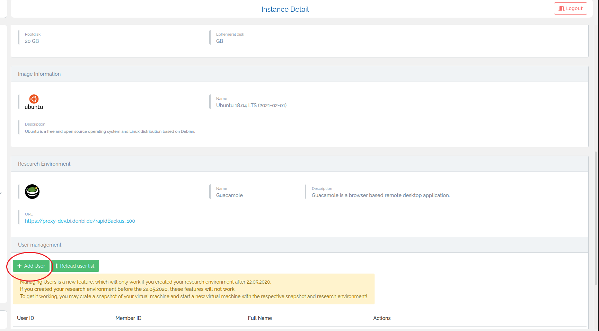

# Enable concurrent sessions for Guacamole 

If you use the default settings for the Guacamole research environment only one user can 
log in at a time. The sessions of other users are terminated, when one user logs in. You can enable more concurrent sessions
by adding more users to Guacamole following these steps.

### Add user to Guacamole
If you have not done so already add the user to Guacamole in the instance detail view
under "User management".

### Access Guacamole
Access Guacamole as usual using the link provided in "How to connect" of your virtual 
machine in the instance overview.

### Open the terminal
Open a new terminal window (see image).

### Add a user
Add a new user use the following command:

> sudo adduser USERNAME

Instead of USERNAME use the actual name that you want to use. It can be chosen arbitrarily.
It is important that you remember the password when it is asked. The other questions can be
left blank (just use enter to skip).

### Grant root privileges (optional)
If you want to give the new user root (admin) privileges use the following command:

> sudo usermod -aG sudo USERNAME

Fill in the actual name for USERNAME.

### Install gedit (optional)
If you are unfamiliar with the editors nano or vi it makes sense to install gedit as 
it is easier to use. In order to install gedit, use the following command:

> sudo apt-get install gedit

### Add user to Guacamole
Now you need to add the new user to Guacamole. If you installed gedit use it to open this file:

> sudo gedit /etc/guacamole/user-mapping.xml

Otherwise, use the editor of your choice, e.g. vi:

> sudo vi /etc/guacamole/user-mapping.xml

Add the following lines to the file (in between the tags <user-mapping>, but after the tag < /authorize>, see image):

        <authorize
                username="USERNAME"
                password="PASSWORD">

        <connection name="Ubuntu Server">
                <protocol>rdp</protocol>
                <param name="hostname">127.0.0.1</param>
                <param name="port">3389</param>
                <param name="username">USERNAME</param>
                <param name="password">PASSWORD</param>
        </connection>

        </authorize>

Again fill in the actual username and password where USERNAME or PASSWORD is written (ONLY the 
occurrences with capital letters, do NOT change "username" and "password").

Save and close the file (use STRG + s in order to save, if you are using gedit).

###  Finish
Now another user can use these credentials to start a concurrent session while you are running your 
main session using the default credentials. Please note that you need to repeat this process (with different usernames) for every
user which wants to run a concurrent Guacamole session on this virtual machine.
