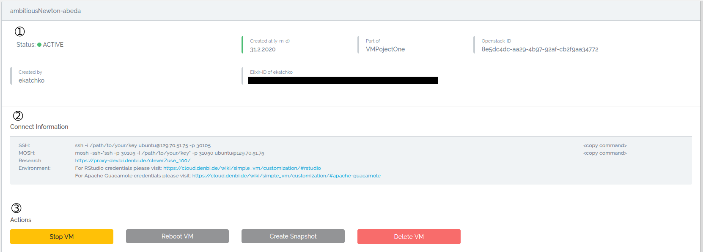

# Instance detail
Here we will guide you through the virtual machine detail page.

## General information

Here you will find various information about the virtual machine.  

1. You will find the name, when and by whom it was created, which project it belongs to, the elixir id of the user who 
started the VM and the unique openstack id of the virtual machine.  

2. Further you will find information on how to connect to your virtual machine and  

3. some actions you can execute:  
    * Stop VM: this will shutoff the virtual machine, also setting the status to 'SHUTOFF'. It will be resumable, 
    but you will not be able to interact with it in any form while it is shutoff.  
    * Reboot VM: this will either soft reboot or hard reboot your virtual machine. From 
    [openstack](https://docs.openstack.org/mitaka/user-guide/cli_reboot_an_instance.html): A soft reboot attempts a 
    graceful shut down and restart of the instance. A hard reboot power cycles the instance.  
    * Create Snapshot: this will let you take a snapshot of the virtual machine, allowing to boot a new virtual 
    machine with it. For more information on snapshots please visist the respective wiki page.  
    * Delete VM: this will delete the virtual machine and everything on it. If a volume is attached, it will 
    get detached but not deleted!  
    * Restart VM: this will boot up your shutoff virtual machine.  
## Flavor information

Here you will find information about the ressources the virtual machine uses. For more information on flavors, 
please visist the [flavor wiki page](../Concept/flavors.md).
## Image information

Here you will find some information about the image the VM was started with. To find more information about images, 
please visist the [respective wiki page](./snapshots.md).
## Installed Conda Packages

If conda tools were chosen, you will find an overview of the tools and packages which were installed when starting the 
machine. For more information, please visist the [customization wiki page](./customization.md#conda).
## Attached Volumes

If at least one volume is attached, you will find information about the attached volumes. Here you will find the name, 
the unique id, the path it was initially mounted to, the device and the storage capacity. For more information on volumes, 
please visit the [respective wiki page](./volumes.md).
## Research environment

If a browser based research environment was installed, you will find the URL and some information about the installed 
research environment here. For more information, please visist the [customization wiki page](./customization.md#research-environments).
### User management

Here you may configure which users are allowed to connect to your research environment. Please note, that this does not
automatically allow for concurrent sessions for some research environments. To allow concurrent sessions, please consult
the specific section of your chosen research environment [concurrent sessions guide](./customization.md#research-environments).
