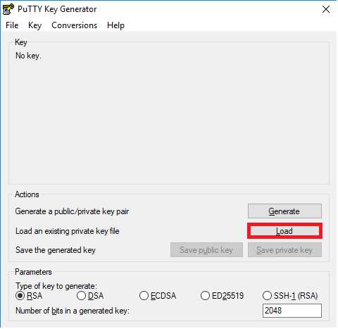
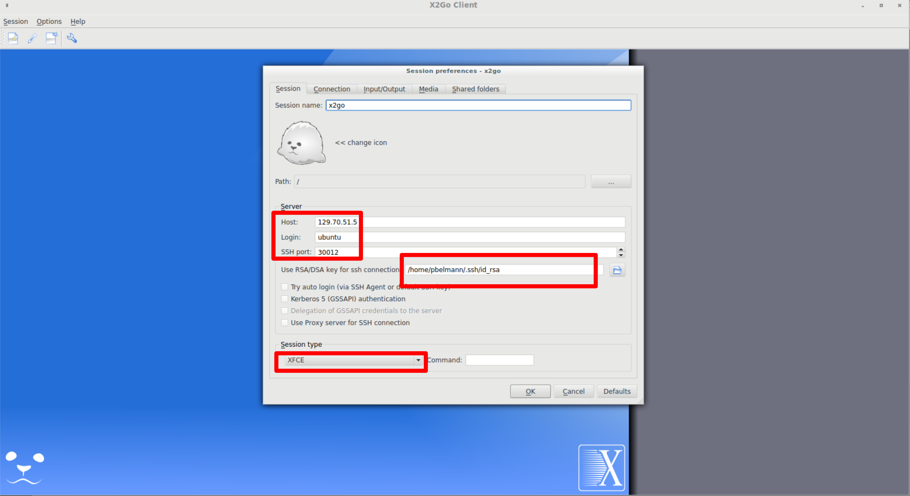
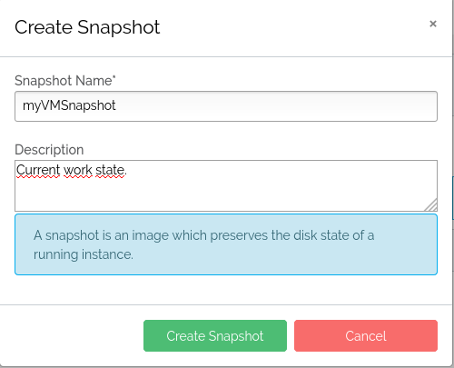

# Images and Snapshots

## Images
Images are files that contain a bootable operating system, e.g. Linux derivatives. Each of the different compute center provide a selection of Images you may use to boot up a virtual machine. If you want more behind-the-scenes information, please visit the respective wiki page.
### X2Go Image
X2Go Images allow you to start your own desktop in the de.NBI Cloud which you can access from
any operating system (Windows, Linux, MacOS).

!!! Guacamole
    Please note, that as an alternative we now offer [Apache Guacamole](customization.md#apache-guacamole).

#### (Windows only) Export key in OpenSSH format for X2GO
To connect to a machine with X2GO you have to export your private key in openssh format. To achieve this first load your private key into puttygen.

Then click Conversions and choose Export OpenSSH Key. Afterwards save this file on your computer. This file will be needed when you want to establish a connection to a machine with the X2GO client.

#### Connect to X2GO machine

You can start an X2Go image when you select an image starting with the X2Go label e.g `X2Go_xfce`.
Once your image started, you will see a message similar to the following one:

Provide the data in the red rectangle in the settings of your x2go client:

You also have to select the session type and the private key of your public ssh key that you provided in the user information tab.

## Snapshots
A snapshot is an exact copy of your virtual machine. A snapshot of an instance can be used as the basis of an instance and booted up at a later time. 
### Create Snapshot
After starting a machine you can go to the [instance overview](instance_overview.md#9-actions) tab and create a snapshot.  
A window opens where you can enter a name for your snapshot and confirm it by pressing Create Snapshot.  

### View Snapshots
  

1. Here you may set how many snapshots you want to see per page and scroll through the pages.
2. Here you may filter your list of snapshots. In the text field you may filter by name, project name and the snapshot openstackid.
3. Here you will find some actions which will be run on all snapshots selected by the checkbox you will find at the right of each snapshot. Also you may choose to select all snapshots by clicking 'Select all'.
4. Here you will find some information about your snapshot: the name of the snapshot, the project name and the status.
5. Here you may delete the snapshot.
### Start Snapshot
After the snapshot is successfully created you can go to the [new instance](./new_instance.md) tab and choose the created snapshot as an image to start a vm. 
