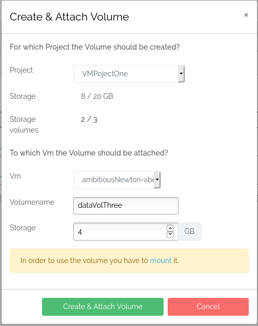

# Volumes
Volumes are additional disk space you may create, attach and detach to and from virtual machines.
## Layout

### 1. Create and attach a volume
Here you may create and attach a new volume. For more information, please see [below](#create-a-volume).
### 2. Pagination
Here you may set how many volumes you want to see per page and scroll through the pages.
### 3. Filter
Here you may filter your list of volumes. In the text field you may filter by volume name, volume openstackid, project name and virtual machine name.
### 4. Actions
Here you will find some actions which will be run on all volumes selected by the checkbox you will find at the right of each volume. Also you may choose to select all volumes by clicking 'Select all'.
### 5. Information
Here you will find some information regarding the volume: the project it belongs to, the virtual machine it is attached to, the name of the volume, the status of the volume and the storage size.
### 6. Actions

Here you will find some actions you can execute:  

* Attach volume: attaches an available volume to an existing virtual machine.
* Detach volume: detaches an in-use volume from an existing virtual machine.
* Extend volume: extends the size of the volume if your project has enough ressources left. For more information, please see [below](#extend-a-volume).
* Delete volume: deletes the volume and all its data.

!!! info "Attaching and detaching"
    Attaching and detaching volumes is only possible, when the machine the volume is attached or shall be attached to is running.

## Create a volume
There are two ways to create a volume:

1. When starting a virtual machine you can choose to start a volume, see the respective wiki page. The volume is automatically mounted this way.

2. At the Volume tab you can choose to create a volume.


In order to use the new volume you need to create a filesystem and [mount](#mount-a-volume) it.

## Create the volume file system (once)

To be able to place files onto your newly attached volume there needs to be a file system on it. This process of file system generation is also called "formatting the device".
First, use this command to list all the block devices connected to your VM:

```BASH
lsblk
```


Now find the entry that corresponds to the volume you have attached previously. On most VMs it's the second item in the list, but you absolutely should verify that using its SIZE as well as through the fact that its MOUNTPOINTS should be empty.

!!! Danger "Formatting any device WILL DESTROY ALL THE DATA already on it!"
    New data disks (e.g. volumes) need to be formatted EXACTLY ONCE to use them.
    NEVER apply this command to an ALREADY FORMATTED DISK if you value the data on that disk.

Format the volume with a filesystem (e.g. `ext4` or `xfs`):

```BASH
mkfs.ext4 /dev/vdx
```

## Mount a volume

Create a mountpoint using

```BASH
mkdir -p /vol/volume
```

Check that you have the correct permissions for this directory, otherwise set them with the follwoing command

```BASH
chmod 777 /vol/volume
```

And mount the Cinder Volume under the created directory

```BASH
mount /dev/device_name /vol/volume
```

Now you should see your device by executing the command

```BASH
df -h
```

If you do not need you Cinder Volume you can also unmount it with

```BASH
umount /dev/device_name
```

## Extend a volume
If you have a volume and want to increase the volume size, you can do this at the volume overview.


!!! caution "Volume must be available"
    The volume must be detached from any virtual machine!


After you have extended your volume you need to attach the volume to your vm.
Depending on which filesystem you use on your volume
there are different procedures necessary to make the new capacity available.

###  XFS formatted filesystem

[Mount](#mount-a-volume) the volume as usual and run the following command
```BASH
sudo xfs_growfs -d <MOUNTPOINT>
```
If you followed the instructions above the <MOUNTPOINT> would be ***/vol/volume***
After that you can use the extend volume with the new capacity.

###  Ext4 formatted filesystem

Do not mount the volume. If you can see it with:

```BASH
lsblk
```

Run the following command to increase the capacity:

```BASH
sudo resize2fs </dev/device_name>
```
The </dev/device_name\> is the same you have used in the mount command
above.
Now you can mount and use the volume as usual and also the extended capacity.

###  Another formatted filesystem

If you use another filesystem than xfs or ext4 please look up if and how an increase
of the capacity is possible.


