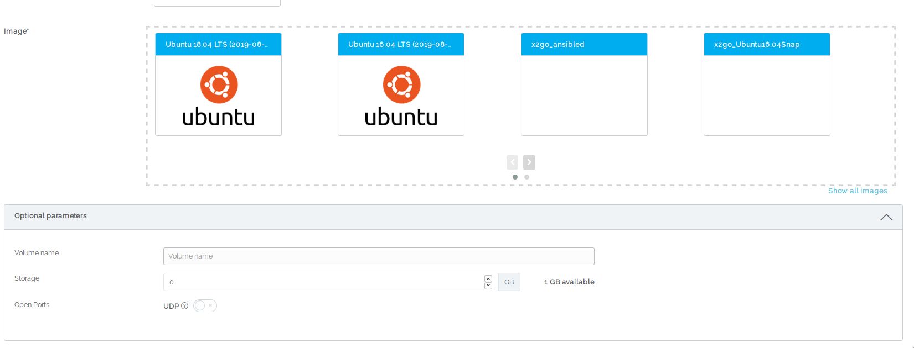

## Volume

### Create Volume

There are two ways to create a volume:

1.When starting a virtual machine you can choose to start a volume when selecting optional params.


The volume is automatically mounted this way.

2.At the Volume tab you can choose to create an volume.


In order to use the Volume you need to [mount](#mount-a-volume) it.

### Mount a volume

In order to mount a volume connect via ssh to your machine.
You will find your volume with the command

```BASH
lsblk
```

This command will list all your block devices connected to your VM.
Chose the correct device (mostly the name will be the second entry, you can orientate oneself on the SIZE parameter) and format it with a filesystem if you are using this volume for the first time.
Common filesystems are ext4 or xfs.

```BASH
mkfs.ext4 /dev/device_name
```

After the formating you have to create a mountpoint

```BASH
mkdir -p /mnt/volume
```

Check that you have the correct permissions for this directory, otherwise set them with the follwoing command

```BASH
chmod 777 /mnt/volume/
```

And mount the Cinder Volume under the created directory

```BASH
mount /dev/device_name /mnt/volume
```

Now you should see your device by executing the command

```BASH
df -h
```

If you do not need you Cinder Volume you can also unmount it with

```BASH
umount /dev/device_name
```

### Extend a Volume
If you have a volume and want to increase the volume size, you can do this at the volume overview.


> **_NOTE:_**  The volume must be detached from any virtual machine!


After you have extended your volume you need to attach the volume to your vm.
Depending on which filesystem you use on your volume
there are different procedures necessary to make the new capacity available.

#####  XFS formatted filesystem

[Mount](#mount-a-volume) the volume as usual and run the following command
```BASH
sudo xfs_growfs -d <MOUNTPOINT>
```
If you followed the instructions above the <MOUNTPOINT> would be ***/mnt/volume***
After that you can use the extend volume with the new capacity.

#####  Ext4 formatted filesystem

Do not mount the volume. If you can see it with:

```BASH
lsblk
```

Run the following command to increase the capacity:

```BASH
sudo resize2fs </dev/device_name>
```
The </dev/device_name\> is the same you have used in the mount command
above.
Now you can mount and use the volume as usual and also the extended capacity.

#####  Another formatted filesystem

If you use another filesystem than xfs or ext4 please look up if and how an increase
of the capacity is possible.


