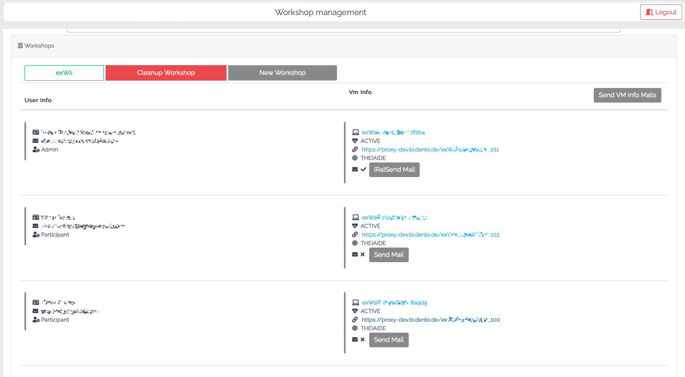

# Workshops

On this page we will show you how to create a workshop, where to get more information on your workshop and 
also some good general practices.

## Allocation and management

In order to offer a workshop and receive the necessary resources, you must submit a project application. To do this, select the SimpleVM project type and mark the Workshop item in the corresponding application. Further information about the application process can be found under [Allocation](./portal/allocation). 

### Create a new workshop
We offer you the ability to manage your workshops more conveniently. You may create a workshop and start multiple virtual 
machines for your participants with just a few clicks. 

As soon as your application got approved, all project administrators are able to create and manage workshops within the portal. The corresponding functions are then linked as separate menu items in the sidebar for administrators. 

Go to "Manage Workshops" to create your workshop.
Then select the corresponding project in which the workshop is to be started. Only projects for which you can start workshops are displayed in the selection. If you are a member of other projects for which the workshop functionality has not been requested, these projects will not be displayed here.
Click on "New Workshop" to enter the desired name and shortname.
You can create as many workshops as you want here, and use them to create different configurations.
Keep in mind here that the number of machines available is tied to the resources from the project application.

!!! Note
    The shortname of your workshop will be used, inter alia, for naming of virtual machines and research environment links.

### Participants and their virtual machines

To add participants to your project, use the corresponding function in the [project overview](./portal/project_overview)
[!add_members_ws](./img/workshop/workshop_add_members.png)

## Start virtual machines for your participants

In the sidebar you can find the menu item "Add workshop VMs". Go there and once again select the corresponding project and the desired workshop you have created in the 
Once you select a workshop, you will see a form similiar to the [New Instance](new_instance.md) form.  

You will need to select a flavor, an image, a research-environment and the participants you want to start a virtual machine for. 
!!! Note
    Note that there are also images available that already contain a running Research Environment.
You may also start virtual machines for your admins and at participant selection you will see an icon if a virtual machine is already started for the participant. You may start as many virtual machines for a participant as you have resources.
 

The machines and the research-environment links will be named automatically and will have the form 
`<WORKSHOP-SHORTNAME><PARTICIPANT-LASTNAME><PARTICIPANT-FIRSTNAME>` and will be truncated to a maximum of 25 characters.  
We will place the public SSH key of every admin of your project on every started machine, so that every admin of your project has 
SSH access to every started machine.  
The research-environment will be accessable by the participant and the admin who started the virtual machine.  

Once you selected everything you need and confirmed the checkboxes at the bottom of the for, you may start the virtual machines and you will get taken to the instance overview, where you will find more information about the status of the virtual machines.

## Workshop and virtual machine overview
You may find an overview of your created workshops at the workshop management. Go to "Manage workshops" again and after selecting the desired workshop you have created you will find an overview of your participants and their preferred E-mail adresses. 

Here you are also able to view which machines and which Research Environments you have started for which participants and whether the machines are currently running. In addition, the links to the Research Environments are available. You can send the necessary information to each individual user by mail or copy it from this overview. The corresponding mail can also be sent simultaneously to all users for whom a VM was started by clicking on "Send VM Info Mails". 

## Best Practices

### Preparation
It is advised to add your participants to your project a couple of days beforehand. This will help with a smoother 
start of your workshop. They will need to have or make an account for the de.NBI portal in order for you to add them. 
If you are not sure if they have an account you can send your participants the [wiki site](../registration.md) where 
the registration process is explained. 

### SSH keys
!!! Info
    If your participants do not need to login to their machines with SSH, please ignore this paragraph.

There are many users to whom the concept of SSH keys is foreign and therefore it is important to explain 
the users the basic concept of SSH keys, in case that they have no prior knowledge about them.
Furthermore, it is important to tell users to pay attention if they create a key pair using the de.NBI portal. While 
the public key is stored on the portal, they need to save the private key on their computer themselves.  
As workshops tend to have a lot of new content and participants may be overwhelmed, it is important to 
explain them these steps patiently and make sure everyone follows through, as they will not be able to access their 
machines later on, if they lose their private key.
!!! Tip
    Make sure the admins of your project also have their SSH key set.

### Access to machines

!!! Info
    By default, workshop participants are not allowed to start machines on their own. This restriction can be waived in the project overview.
    

## Trouble Shooting
If you experience troubles, have feedback on our services or have a special request please do not hesitate to contact 
us under cloud-portal-support@denbi.de.
